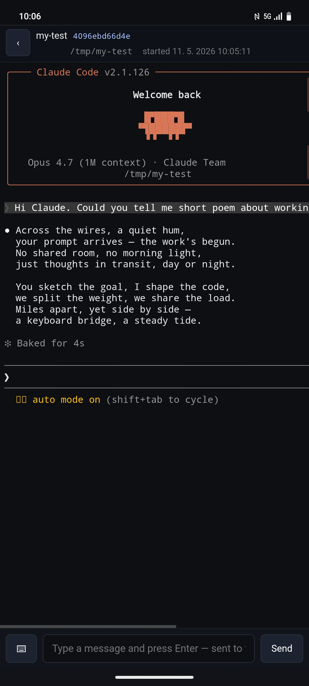

# TermPilot

Remotely view and control **any terminal session** through a PHP relay
on shared hosting. Run `bash`, `tmux`, `htop`, or anything else
interactive on a PC, and drive it from a browser on your phone or
another machine. **End-to-end encrypted**: the relay sees only
ciphertext blobs; only the PC running `termpilot-wrap` and the browser
hold the keys.

For architecture, threat model, and operational notes see
[`ARCHITECTURE.md`](ARCHITECTURE.md). This file is the user-facing setup guide.

<p align="center">
  
</p>

## What you get

- **Terminal view** (`index.html`) — live xterm.js mirror of your local
  PTY plus a control bar (Esc, Ctrl-C, ↑/↓, Tab, Sh-Tab, Enter) and a
  text input that types into the running session.
- **Installable PWA** — add to home screen on Android / iOS, install as
  a desktop app on Chrome/Edge. Auto-update banner appears when a new
  version is deployed.
- **Push notifications** — opt-in. Service worker is wired up; v1 of the
  wrapper does not fire any push triggers itself. The plumbing stays so
  you can add triggers later (e.g. terminal bell, exit status) without
  touching the service worker.
- **Resilient to flaky networks** — connection-state badge (●/◐/○),
  offline session detection, queued sends that survive a closed tab and
  drain in the background when connectivity returns (Chromium; foreground
  drain everywhere else), durable encrypted output spool against wrapper
  SIGKILL.
- **Fast session switching** — each session keeps its own offscreen
  xterm in memory, so leaving and re-entering is instant. `pollLoop`
  resumes from the saved cursor and only fetches new bytes. The view
  always scrolls to the bottom on open so you see the latest first.
- **Per-device tokens**, grouped in the sidebar. The browser only shows
  sessions whose marker decrypts with one of your tokens. Sessions are
  listed newest-first within each token; sessions whose wrapper has gone
  silent (alive=false) sink to the bottom of the list with an "offline"
  pill.
- `RELAY_SECRET` (Bearer auth) is optional but recommended. Without
  it the relay runs OPEN — anyone who finds the URL can register fake
  sessions / write encrypted noise. Content stays encrypted under
  per-device tokens regardless, and `op_close` / `op_push_notify` are
  token-bound, so the loss is spam/DoS not confidentiality.

## Server-side install (shared PHP host)

1. Upload everything under `php/` to a web-accessible directory on the
   host (e.g. `public_html/term/`). The bundled `.htaccess` blocks
   `data/`, `logs/`, `config.php`, and common editor backups
   (`*.bak`, `*.swp`, `*.dist`, hidden dotfiles).
   The `php/lib/vendor/` tree (xterm.js + jsQR, MIT / Apache-2.0; see
   `php/lib/vendor/NOTICE`) is uploaded verbatim — no CDN is hit at
   runtime, so a strict CSP can lock script-src to `'self'`.
2. (Recommended) Copy `config.example.php` to `config.php` and set
   `RELAY_SECRET` to a random 32-byte hex string
   (`openssl rand -hex 32`). Skip to run unauthenticated — content
   stays encrypted regardless; this is only a spam gate.
3. (Optional) Set `ADMIN_SECRET` in `config.php` if you want to enable
   the `?op=gc` cleanup endpoint. Trigger from a daily cron:
   ```sh
   curl -X POST -H "Authorization: Bearer $ADMIN_SECRET" \
        -H "Content-Type: application/json" -d '{}' \
        https://your.host/term/relay.php?op=gc
   ```
4. Make sure PHP can write to that directory (it creates `data/` and
   `logs/` on first request — and `data/vapid.json` on first push use).
5. (Apache works as-is. On nginx, replicate the `.htaccess` rules:
   `location ~ ^/term/(data|logs)/ { return 403; }` and similar for
   `config.php`. Also add `application/manifest+json` to your MIME
   types and a no-cache directive on `sw.js` so PWA updates propagate.)
6. Visit `https://your.host/term/`. The login modal asks for any
   tokens you've set up on PCs (and the relay secret if you set one).

The bundled `tools/deploy.sh` ships `php/` over FTPS using `~/.netrc`
and backs up the live files into `server-logs/backup-<ts>/` (keeps the
latest 5; older backups are trimmed automatically). It also stamps a
UTC build timestamp into `sw.js` so every deploy bumps the PWA cache
version and triggers the in-app update banner.

## PC-side install (end users)

Supported on **Linux** and **macOS**. Requirements:

- Python 3.9+ (stdlib only — no pip dependencies for the wrapper itself).
- A POSIX shell (`bash` or `zsh`).
- `curl` and `unzip` (almost certainly already present).
- *(optional, recommended)* the `keyring` Python package, so the token
  goes into GNOME Keyring (Linux) or macOS Keychain instead of a chmod-600
  file: `pipx install keyring` or `pip install --user keyring`.

One-liner: download the latest release zip, extract to
`~/.local/share/termpilot/`, run the bundled `install.sh`, and offer
to mint a device token + deploy the relay:

```sh
curl -fsSL https://raw.githubusercontent.com/hawwwran/termpilot/main/install-latest-version.sh | bash
```

Or, if you've already downloaded `termpilot.zip` from a GitHub release
and extracted it somewhere, just run the bundled installer:

```sh
./install-latest-version.sh
```

Then keep up with new releases:

```sh
termpilot --version    # prints installed version + checks GitHub for newer
termpilot --update     # if a newer release exists, prompts to install it
```

You also get a passive nudge for free: each `termpilot` session start
does a fast (3-second budget) background check against GitHub and, on
the *next* session start, prints a coloured one-line notice if a newer
release is parked. The check is silent if GitHub is unreachable and
skipped entirely in dev checkouts, so it never blocks or noises up
your terminal. See [`ARCHITECTURE.md`](ARCHITECTURE.md#on-start-update-notice-deferred-two-phase)
for the exact flow.

## PC-side install (develop / contribute)

If you cloned the repo and want to point `termpilot` at the dev tree
instead of the installed copy:

```sh
cd ~/git/termpilot
./install.sh                              # repoints `termpilot` at this checkout
termpilot --set-relay-url https://your.host/term
termpilot --set-relay-secret 'XXXX'       # only if you set RELAY_SECRET in config.php
termpilot --generate-token                # sudo-gated; mints a random 32-byte token
                                          # and shows the hex (paste into the browser)
```

Run the dev-tree `install.sh` to switch to the dev checkout; run the
installed-copy `~/.local/share/termpilot/install.sh` to switch back.
Updates triggered while pointed at a dev checkout (`termpilot --update`)
re-extract to `~/.local/share/termpilot/` and repoint the shell function
there — your dev tree's files are never touched.

`install.sh` writes a fenced source-line block into whichever rc file
matches your shell — `~/.bashrc` on Linux, `~/.zshrc` on macOS — plus
any of `~/.bashrc`, `~/.bash_profile`, `~/.zshrc` that already exist, so
you can switch between bash and zsh later without re-running install.
It also defines a short `tp` alias for `termpilot` — but only if
nothing else on the system already provides a `tp` command; install a
conflicting tool later and the alias silently steps aside on the next
shell start.

`--set-relay-secret` writes `~/.config/termpilot/relay-secret`
(chmod 600). The wrapper refuses to load that file if perms are
looser. Use `--clear-relay-secret` to remove it later. If your relay
runs without `RELAY_SECRET`, skip this step — the wrapper proceeds
unauthenticated and content stays encrypted regardless.

Then in any project directory:

```sh
termpilot                          # spawn $SHELL through the wrapper
tp                                 # same as `termpilot` (if alias is active)
termpilot bash                     # spawn bash explicitly
termpilot tmux new -A -s main      # attach/create persistent tmux session
termpilot htop                     # any interactive program in a PTY
tp claude                          # any command works — no -- needed
termpilot --show-token             # sudo-gated; reveal the stored token
termpilot --get-relay-url          # print the currently configured relay URL
termpilot --force                  # bypass the per-cwd single-instance lock
```

(Use `termpilot -- <cmd>` explicitly only when the child command takes a
flag that collides with one of the wrapper's own: `--force`, `--insecure`,
`--no-local`, `--title`, `--relay`, `--auth`. Otherwise the `--` is
unnecessary.)

Each `termpilot` invocation registers a new session on the relay and
spawns the given command (or `$SHELL` if none given) in a PTY. The
title shown in the browser sidebar defaults to `basename "$PWD"`.

For long-lived sessions that survive `termpilot` exiting, wrap the
command in `tmux new -A -s <name>` — attaching/detaching is free, and
the next `termpilot tmux new -A -s <name>` from any tab reconnects.

If a previous wrapper crashed within the last 5 minutes, the new wrapper
reuses the same relay session id and replays any unsent output bytes
from the on-disk spool.

### Running multiple sessions in the same directory

Just open another terminal and run `termpilot` again. Each terminal
window (or tmux/screen pane) gets its own resilience slot automatically,
keyed by the controlling TTY's pts label. Crash-recovery still works
within the same terminal window.

If you want a stable human-readable name instead (handy for telling
sessions apart in the browser sidebar, or for running from cron / a
script where there is no TTY), pass `--instance NAME` or set
`TERMPILOT_INSTANCE=NAME` in the environment. Charset:
`[a-zA-Z0-9_.-]`, length 1-64.

## Browser-side (and PWA install)

1. Visit your relay URL.
2. Login modal: (relay secret if required) + first device token + a
   device label (e.g. "Desktop").
3. Use **manage tokens** (in the sidebar header, or on the "no active
   sessions" hero) to add more devices or remove old ones. Each PC's
   token belongs to a device label; sessions group by label.
4. **Install as an app**: in Chrome / Edge / Safari, use "Add to Home
   Screen" or the install button in the URL bar. The app launches
   into the terminal view standalone.
5. **Enable push notifications**: open manage tokens → "Push
   notifications" section → click **Enable notifications**. Approve the
   browser prompt. (No wrapper-side triggers are wired in v1 — the
   subscription is dormant until you add one.) On iOS, push only works
   after the app is added to the Home Screen.

Tokens live in `localStorage` indefinitely. Clear them through the
manage-tokens modal or by clearing site data.

## Local test (no hosting needed)

```sh
cd php
cp config.example.php config.php          # optional; or skip for no-auth
php -S 127.0.0.1:6019 -t .
# different terminal:
cd ..
TERMPILOT_RELAY=http://127.0.0.1:6019/relay.php \
  ./termpilot-wrap run --insecure --title demo bash
# browser: http://127.0.0.1:6019/index.html
```

`php -S` is single-threaded, which matters for long-poll testing — see
the operational notes in [`ARCHITECTURE.md`](ARCHITECTURE.md).

Run the Python test suite (`tests/run-all.sh`) before deploying.

## Layout

```
termpilot/
├── termpilot-wrap               main wrapper binary (multi-subcommand)
├── install.sh                   installs the `termpilot` shell function
├── install-latest-version.sh    end-user bootstrap (downloads latest release zip)
├── VERSION.json                 release metadata, read by --version / --update
├── lib/                         Python crypto + keystore modules
├── php/                         what gets uploaded to the host
│   ├── relay.php                encrypted byte/input/push API
│   ├── index.html               terminal view (the only view)
│   ├── manifest.webmanifest     PWA manifest
│   ├── sw.js                    service worker (cache + push + bg-sync)
│   ├── icon-*.png               app icons (192/512, regular + maskable)
│   ├── lib/                     browser JS (crypto.js, session.js, keyboard.js)
│   ├── config.example.php       copy → config.php
│   └── .htaccess                denies data/, logs/, config.php; PWA MIMEs
├── tests/                       run with tests/run-all.sh
├── tools/
│   ├── lib-ftp-host.sh          shared FTP-host + credentials resolver
│   ├── deploy.sh                upload php/ over FTPS (~/.netrc)
│   └── fetch-logs.sh            pull relay.log via FTP
├── .github/workflows/release.yml CI: on v* tag, build and attach termpilot.zip
└── ARCHITECTURE.md              architecture, threat model, ops notes
```

## Wrapper-side cache + diagnostics

The wrapper writes per-cwd state to `~/.cache/termpilot/`:

- `cwd/<encoded-cwd>/<instance>/wrapper.lock` — single-instance lock per
  (cwd, instance). `<instance>` defaults to the controlling TTY's pts
  label (e.g. `pts-3`), so two terminals in the same cwd get separate
  slots automatically. Override with `--instance NAME` or
  `$TERMPILOT_INSTANCE`; falls back to `"default"` for non-TTY stdin.
- `cwd/<encoded-cwd>/<instance>/active.json` — last `wrapper_sid` + marker for
  crash recovery (re-uses the sid if a wrapper crashed within the last
  5 minutes in the same slot)
- `sid/<sid>/out.{spool,cursor,next_seq}` — durable encrypted output
  queue; survives wrapper SIGKILL
- `events.log` (rotates at 256 KB) — structured JSONL diagnostics.
  Current categories: `wrapper_start`, `recovery_no_marker`. Future
  wrapper-side push triggers (terminal bell, exit status, …) will
  add their own `push_*` events here. Set `TERMPILOT_DEBUG=1` to also
  mirror events to stderr.

## Going beyond shared hosting

Anything that runs PHP works. If you have your own VPS, replace the
relay with a real HTTP service speaking the same JSON; the wrapper and
browser are agnostic. The wrapper only needs `TERMPILOT_RELAY` and (optionally)
`TERMPILOT_SECRET`.
